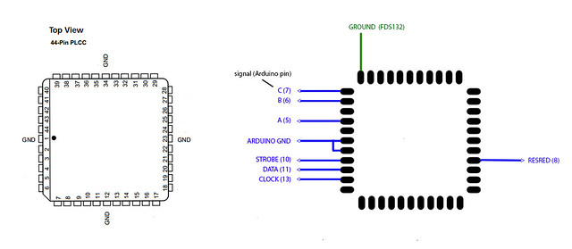
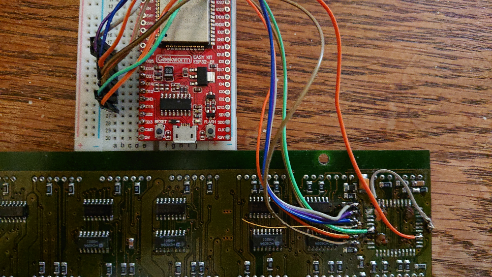

This is a library for Arduino (and esp32-arduino) to drive FDS132
LED boards.

FDS132 led boards are boards with 3 areas of 7x90 red LEDs.

# How they work

The FDS132 is driven as a 270-LED wide line of height 7. There are shift-
register chips chained to form a 270-bit register, which can be used to
show a pattern for 1 row at a time.

# Where to get them

The boards are occasionally available from https://www.baco-army-goods.nl/

# Electrical connection

You can read more about the board at http://arduinows.blogspot.nl/2013/04/fds132-ledmatrixbord.html

This library works with the CPLD chip removed from the board. You connect
the following pins that used to be driven by the CPLD to your arduino/esp32:

Instead of soldering the tiny CPLD pads, it is easier to solder against the
resistors next to them (you can double-check with a multimeter that you have
the right one):

You also want a 7,5V power adapter to power the board itself (via the white
connectors).

# How to use this library

See the 'examples' directory for some examples on how to use this library.
In short, you create a `fdsScreen` instance and use `setPins()` to configure
which pins are used for what. Then you have to call `initialiseLetters()`
to initialise the letters.

The library has 2 buffers: a text buffer and a bitmap buffer.

* `mainScreen.addString()` sets the characters in the text buffer
* `mainScreen.update()` clears the bitmap buffer and renders the text
  in the text buffer to the bitmap buffer
* `mainScreen.display()` briefly lights up the right LEDS for each row

By calling `mainScreen.display()` often enough from your `loop()`, you
get a visually stable image.
